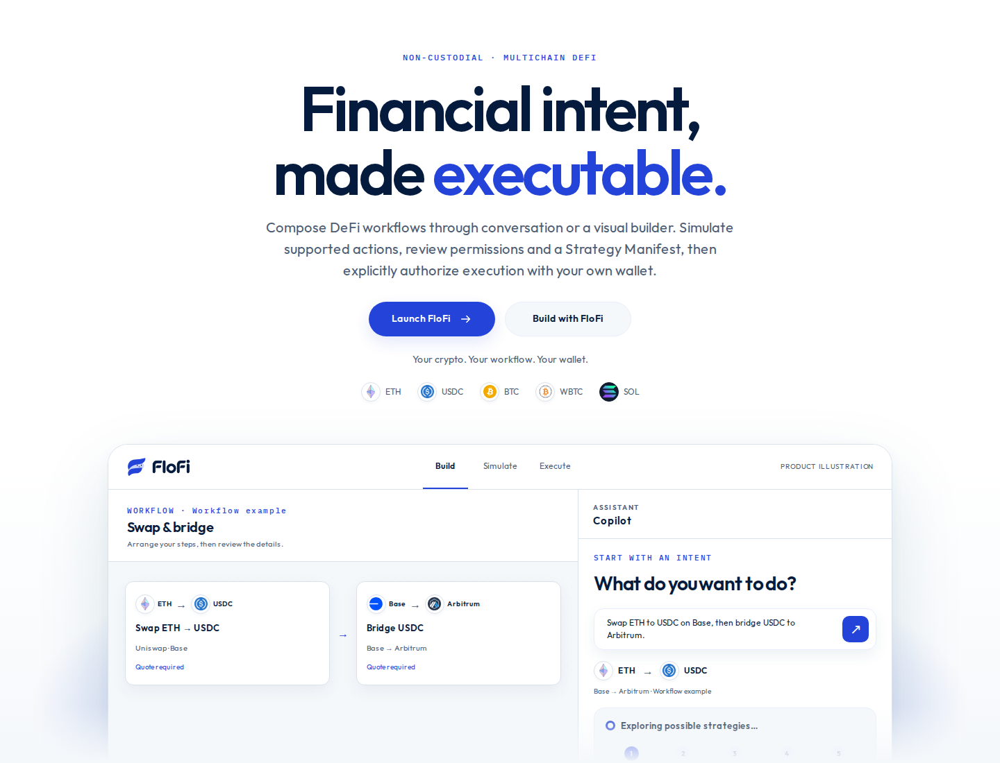
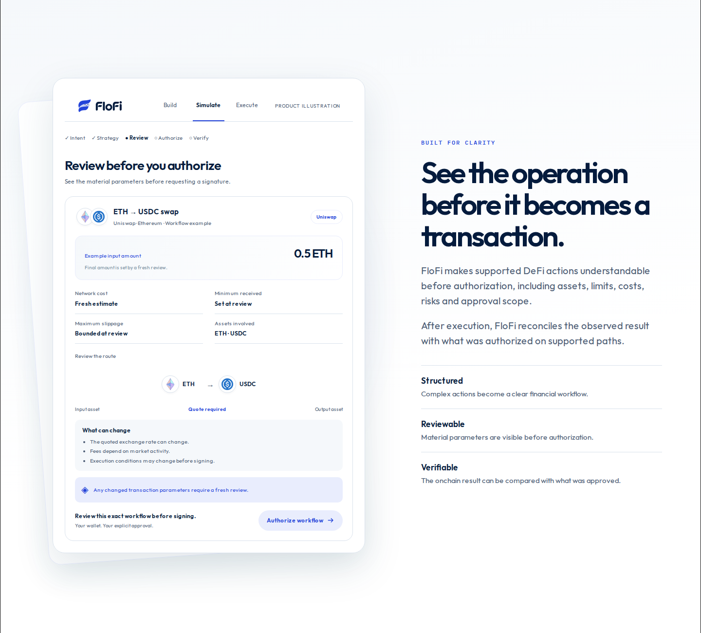
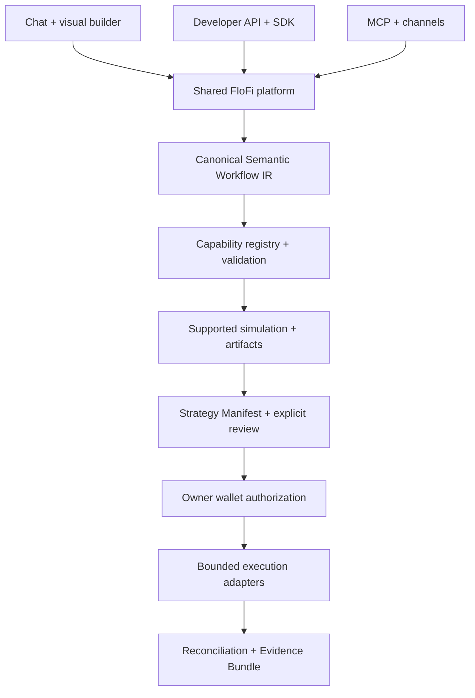

<p align="center">
  
</p>

<h1 align="center">FloFi — financial intent, made executable.</h1>

<p align="center">A non-custodial multichain DeFi workflow platform.<br />Compose through conversation or a visual builder. Simulate, review, then authorize with your own wallet.</p>

<p align="center">
  <a href="docs/developer/README.md">Developer docs</a> ·
  <a href="docs/deploy/MCP.md">MCP</a> ·
  <a href="docs/SECURITY_MODEL.md">Security model</a> ·
  <a href="docs/STATUS.md">Evidence &amp; status</a>
</p>



*Illustrative ETH/USDC swap and Base → Arbitrum bridge. Marketing scenarios describe the product vision; they do not establish enabled mainnet execution or production readiness.*

## What is FloFi?

DeFi strategies span networks, protocols, approvals and transactions. FloFi gives those steps a shared, inspectable workflow: an intent becomes a canonical **Semantic Workflow IR**, supported actions are simulated, and the user reviews a **Strategy Manifest** before authorizing execution. Observed results are reconciled against the approved operation and recorded in an Evidence Bundle.

Builders can use the same lifecycle through the app, a server API or MCP. An AI answer, an API key and a chat message have **zero financial authority**. The user's wallet remains the signing authority.

FloFi is under active development. Current `main` contains the implementations described below, with evidence ranging from mocked integration to specific owner-executed testnet/Devnet demonstrations. Availability depends on the action, network, runtime and operator configuration. There is no general mainnet production or audited-security claim. Historical reports can describe older checkpoints or unmerged branches; consult their scope before treating a feature as delivered.

## How it works

1. **Build** — describe an action in chat or configure its card on the visual canvas. Review proposed changes before applying them.
2. **Simulate** — obtain the supported path's quote, state and simulation artifacts. Unsupported combinations fail explicitly.
3. **Review** — inspect assets, amounts, limits, permissions, costs and the Strategy Manifest. Material edits or expired artifacts require fresh simulation and review.
4. **Authorize & execute** — approve the reviewed operation and sign the required transactions in your own wallet. Connecting a wallet does not authorize a transaction.
5. **Verify** — follow execution status, recovery and reconciliation; inspect transaction identifiers and the canonical Evidence Bundle.

Simulation is scoped evidence, not a guarantee of a future outcome. Mocked browser demonstrations remain blocked from financial authorization by the production Review gates.



*Product illustration: review an ETH → USDC strategy, its permissions and execution intent before authorizing with your wallet.*

## Product capabilities

| Capability on `main` | Scope |
| --- | --- |
| Conversation and visual builder | Shared revisioned workflow model; explicit proposal acceptance. The optional Copilot asks for missing facts and proposes supported edits. |
| Simulation and Strategy Manifest | Hash-linked artifacts, validity checks, permission review and invalidation after material changes. |
| Wallet connection and authorization | User-selected EVM/Solana wallets; separate wallet proof, review and transaction signatures. |
| Execution and evidence | Supported path adapters, durable status, recovery, reconciliation and evidence without upgrading its provenance level. |
| Dashboard and saved workflows | Wallet-scoped views and reusable workflows; restoring a workflow requires fresh simulation/review. |
| Developer API, SDK and webhooks | Server-side sandbox integration. Live credentials and mainnet strategies are refused. |
| Remote MCP gateway | Read-only discovery/composition/simulation, OAuth and trusted approval handoffs; operator-enabled. |
| Conversational channels | Shared Channel Core; Telegram adapter awaits owner live acceptance. WhatsApp live activation remains policy-blocked and fixture-only. |

The canvas and chat are two ways to author the same workflow. Visual layout changes do not change financial semantics. A proposal can describe a strategy without giving an agent permission to execute it.

## Multichain, with explicit capability boundaries

FloFi resolves capabilities by **action × network × environment**. Recognizing a chain is different from supporting every action on it.

| Path | Implementation and evidence boundary |
| --- | --- |
| EVM testnets | Selected Uniswap v3, Aave V3 and native-transfer profiles on Base Sepolia, Ethereum Sepolia and Robinhood Testnet. Exact supported assets/actions differ by chain. Specific Base Sepolia operations have recorded owner execution; Ethereum Sepolia implementation alone does not establish public execution. |
| Solana Devnet | Orca swap and concentrated-liquidity paths. A recorded owner swap establishes `DEVNET_EXECUTED` for that exact operation using valueless test tokens. |
| Cross-chain workflows | Selected Across/LI.FI and bridge-to-swap paths with environment-specific gates, recovery and destination evidence. Broader arbitrary sequences are unsupported. |
| Local fork / loopback | Isolated Uniswap, finite Safe/Zodiac Roles permissions, composition and CoW intent demonstrations. Their evidence remains `FORK_REPRODUCED` or `MOCKED`. |
| Mainnet profiles | Some adapters and discovery code exist, including Jupiter. This does not imply mainnet production readiness, public acceptance or enabled integration authority. |

See the [evidence levels](docs/EVIDENCE_LEVELS.md), [current status](docs/STATUS.md) and [build reports](docs/builds). One demonstrated transaction does not certify another asset, protocol, chain or workflow.

## Build on FloFi

- **Developer API + TypeScript SDK:** discover capabilities, create an immutable StrategySpec, validate, obtain a read-only preview, and hand approval to the user. Follow status and evidence the owner chooses to share. Server keys never sign, submit or approve. Start with the [quickstart](docs/developer/QUICKSTART.md), [API](docs/developer/API.md) and [SDK](packages/developer-sdk/README.md).
- **MCP:** expose the shared engine to a configured client through Streamable HTTP, OAuth and a trusted FloFi approval handoff. Local integration tests do not establish live ChatGPT or Claude acceptance. See the [MCP operator guide](docs/deploy/MCP.md).
- **Channels:** Telegram and WhatsApp share proposal, approval and status handling. The financial flow remains in FloFi with the user's wallet. See [Telegram](docs/deploy/TELEGRAM.md), [WhatsApp](docs/deploy/WHATSAPP.md) and [owner acceptance](docs/deploy/CHANNELS-OWNER-E2E.md) for activation boundaries.

## Architecture



The Next.js application lives in [`apps/reference-dapp`](apps/reference-dapp). Shared contracts and the action registry define the workflow boundary. The reference linter, compiler, executor and reconciler implement the lifecycle. The embedded cloud runtime uses durable PostgreSQL state; specific flow runtimes remain separately configured. The [cloud deployment guide](docs/deploy/CLOUD.md) explains that separation.

## Getting started

Use **Node 24.21.0** and **pnpm 11.22.0**, as pinned in the repository.

```bash
git clone https://github.com/alrimarleskovar/gryloo.git
cd gryloo
pnpm install --frozen-lockfile --ignore-scripts
pnpm build
pnpm --filter @defi-workflow-engine/reference-dapp dev
```

Open `http://127.0.0.1:3000` for the public landing or `/app` for the builder. The local shell supports authoring without a wallet. Provider-dependent simulation, persistence, integrations and financial paths need their documented operator configuration; installation alone does not enable execution. Preserve existing `GRYLOO_*` settings and persisted identifiers for compatibility.

```bash
pnpm check                          # types, lint, production build, schemas, unit tests
python3 scripts/governance_lite.py
python3 scripts/test_governance_lite.py
```

Browser and fork suites require the pinned Chromium headless shell, Foundry Anvil and loopback fixtures. PostgreSQL suites require a disposable local database. Follow [the CI workflow](.github/workflows/contracts.yml) for exact setup and guarded profiles; do not replace recorded/mock fixtures with live financial execution.

## Documentation

| Reference | Purpose |
| --- | --- |
| [Product specification](docs/specs/MASTER_SPEC_V3.2.md) | Product model and intended scope |
| [Developer documentation](docs/developer/README.md) | API, SDK and webhooks |
| [Deployment guides](docs/deploy) | Runtime and integration configuration |
| [Canonicalization](docs/contracts/CANONICALIZATION_V1.md) · [Compatibility](docs/contracts/COMPATIBILITY_V1.md) · [Invalidation](docs/contracts/INVALIDATION_V1.md) | Stable contracts and artifact semantics |
| [Authority matrix](docs/AUTHORITY_MATRIX.md) · [Security model](docs/SECURITY_MODEL.md) | Permission and execution boundaries |
| [Status](docs/STATUS.md) · [Build reports](docs/builds) · [Decisions](docs/DECISIONS.md) | Historical evidence, limitations and provenance |
| [Original engineering README](docs/builds/README-ENGINEERING-HISTORY.md) | Preserved build history from the previous README |

## Security principles and scope

FloFi does not hold the user's private keys or seed phrase. AI proposals and integration credentials cannot authorize funds. Execution requires the supported path's fresh artifacts, explicit review and the applicable wallet authorization. Changes, expiry, mismatched identity and unsupported capabilities fail closed. Recovery and reconciliation retain the original evidence level.

Source availability and automated tests are not a security audit. Simulations cannot guarantee execution prices or outcomes. Public demonstrations use the exact testnet/Devnet profiles documented in their reports; real funds and broader mainnet use require separate review and owner action. See [security policy](docs/SECURITY_MODEL.md) and [evidence scope](docs/EVIDENCE_LEVELS.md).

## Roadmap

Current priorities include broader protocol and network coverage, additional supported compositions, live acceptance of configured integrations, and production readiness backed by independent evidence. Privacy and advanced automation remain separately scoped work; visible future controls do not imply executable capabilities. Open PRs and roadmap items are not shipped features. Track the [next-build record](docs/NEXT_BUILD.md) and [repository issues](https://github.com/alrimarleskovar/gryloo/issues).

Tempo is the next supported network in the product roadmap; this branch does not add or enable its runtime integration.

## Contributing and licensing

Follow [GOVERNANCE-LITE](docs/SCOPE_GUARD.md): branch → implementation → tests → PR → CI → human owner merge. Preserve wallet authority, fail-closed gates, evidence provenance, dependency integrity and attribution. Explain limitations and unexecuted checks in your PR.

FloFi is multi-licensed: workflow contracts, action registry, Developer SDK and eligible documentation use **Apache-2.0**; the reference app and reference linter/compiler/executor/reconciler use **AGPL-3.0-only**. Consult [LICENSE](LICENSE) and the authoritative [license map](docs/LICENSE_MAP.md), including third-party exclusions. [NOTICE](NOTICE) and [THIRD_PARTY_NOTICES.md](THIRD_PARTY_NOTICES.md) preserve attribution and provenance. No source license grants FloFi or Gryloo trademark rights; see [TRADEMARKS.md](TRADEMARKS.md).

FloFi was formerly Gryloo. Historical records and runtime identifiers retain that name; the [brand ADR](docs/adr/ADR-0006-flofi-product-brand.md) documents the transition. Founder licensing authority and repository administration remain as recorded in [DEC-0008](docs/DECISIONS.md) and the license map.
