# Universal conversational signing — BUILD-CHANNEL-SIGNING-001

Every conversation reaches the same FloFi `/approve` page and existing financial engine:

```mermaid
flowchart LR
    C[ChatGPT / Claude / WhatsApp / Telegram] --> P[Canonical proposal and workflow hash]
    P --> H[Secure handoff to FloFi]
    H --> W[Owner wallet proof]
    W --> L[Owner loads exact proposal]
    L --> S[Fresh simulation]
    S --> M[Strategy Manifest Review]
    M --> A[Explicit transaction authorization]
    A --> T[Owner wallet signature]
    T --> E[Existing execution and recovery engine]
    E --> R[Reconciliation and evidence]
    R --> N[Status to original conversation with owner consent]
```

Wallet proof is a sign-in message (EIP-4361 or Sign-In With Solana), verified server-side through existing HttpOnly sessions. It is never authorization to spend. Loading the proposal is one explicit owner click after the external summary, steps, network, funds class and workflow hash are visible. The server re-composes and rechecks the proposal, then the existing validated workflow restoration path loads its canonical authoring workflow and invalidates previous Review authority, even if the hash is unchanged. **Continue to simulation** selects FloFi's existing simulation workspace. Simulation, Manifest Review, explicit approval and wallet transaction signatures remain separate mandatory actions. No provider, model or MCP tool receives transaction submission authority.

MCP uses `request_user_approval`, the existing MCP App, `open_approval_session` and progress tools. Capability URLs are only in tool-result `_meta['flofi/approval']`, delivered to the UI. Model-visible `content` and `structuredContent` expose `/approve#apr_…`: a nonsecret reference usable only through the creating account's existing OAuth browser cookie. A new browser cannot exchange that reference. The panel's wallet action opens a short-lived capability for another browser. App-only visibility is not a substitute for result redaction. The MCP SDK describes `_meta` as client data outside the model answer. [MCP SDK result channels](https://py.sdk.modelcontextprotocol.io/advanced/low-level-server/)

On desktop, use the secure FloFi window and the installed wallet selector. On mobile, `/approve` offers MetaMask navigation for EVM and copy/paste in a wallet browser. Phantom's documented `browse` link encodes the destination in the URL path, so FloFi opens only its public landing page and asks the owner to paste the private link inside Phantom. Its current documented domain is `phantom.com`. No handoff capability is encoded in that redirect URL. MetaMask retains the capability in the outer URL fragment; its app must preserve that fragment for the automated path to work, otherwise paste inside its browser. Browser/wallet app behavior remains owner-E2E dependent. [Phantom browse contract](https://docs.phantom.com/phantom-deeplinks/other-methods/browse), [MetaMask official link generator](https://metamask.github.io/metamask-deeplinks/)

Embedded MCP signing stays disabled. The environment probe remains diagnostics only; no injected provider in a host iframe is used to prove ownership, sign or submit. FloFi tests the external window contract, not a vendor's actual iframe security or mobile operating system. WalletConnect/Reown is deferred: the demonstrated requirement is already served by wallet extensions and wallet browsers; no supported owner device requiring a new remote pairing protocol was supplied or tested. A later verified gap would require separately reviewing its relay, session and CSP boundaries. [MCP Apps external-link API](https://apps.extensions.modelcontextprotocol.io/api/interfaces/app.McpUiOpenLinkRequest.html)

Telegram and WhatsApp keep Channel Core, authenticated webhooks, durable deduplication, leases, provider rendering/window policy and the same CHANNEL_CONVERSATION requester. Their button opens `/approve`; text or callbacks like `yes`, `confirm` and `execute` grant nothing. Status sharing is off by default for channel conversations. With consent, the owner-page ping and scheduled dispatch derive notifications from durable run state. Failed/uncertain message sends never determine financial state, and reconciliation alone determines success. MCP progress is projected to public ids, states, evidence environment and bundle hash before `ui/update-model-context`; arbitrary host fields never enter that projection.

## Threat model and recovery

| Threat | Existing boundary and this build's treatment |
| --- | --- |
| Model/provider mistaken for the owner | No signing/submission/Review endpoint on conversational adapters. Handoffs and proof carry authority NONE. MOCKED simulation cannot authorize browser execution. |
| Token in model context or logs | UI-only MCP metadata; nonsecret authenticated fallback; URL fragment moved into tab session storage and removed from address bar. No new payload logging; no Phantom encoded-token redirects. Private links are still visible to the owner and the originating messaging provider; protect those accounts and devices. |
| Cross-tenant/account/conversation reads | Existing tenant-scoped store and requester scope; fallback checks the active account cookie on each request. Another account gets no proposal. |
| Wrong wallet/namespace | Server-derived proof, immutable claimed wallet and channel intended-wallet rule. Solana base58 keys compare case-sensitively; EVM address case is normalized. |
| Wrong chain, changed amounts/recipient or stale simulation | Canonical workflow/hash checks plus existing network/owner/Manifest/exact-payload/freshness checks at the financial boundary. Changing an editor draft invalidates its Review. |
| Expired/revoked/superseded/stale link | Existing lazy expiry/revocation and re-composition; owner page rechecks an unclaimed link every 30 seconds and on claim. It never revives ended handoffs. |
| Duplicate clicks/callbacks | Local opening/claim locks; PostgreSQL handoff transitions and provider event deduplication. A new signing session replaces its predecessor; an applied session remains consumed. |
| Cancellation/rejected sign-in | Close clears this tab's capability/recovery hint and grants nothing; it does not withdraw the request. Reopen an unused link or request a new one. Rejected proof allows retry. Withdrawal still uses Connections (MCP) or STOP/new proposal (channels). |
| Interrupted apply response/reload | Public approval-id hint plus the exact claimant's proven wallet permits read-only reconstruction of an APPLIED proposal across store instances. No capability, Review, signature or transaction authority is renewed. If proof expired, use the existing FloFi sign-in/Connections or obtain a fresh handoff; the page does not infer ownership from its recovery hint. |
| Different link while a response is pending | A different presented link clears the previous recovery hint. Async apply, retry and sharing responses update only the approval generation that initiated them; a delayed response cannot display the previous proposal under the new link. History may retain the hint only for the same consumed fragment. |
| Unknown transaction result/restart | Existing durable execution journal and recovery/reconciliation path; reopen Your runs and observe the existing attempt. Do not start a second run to recover an unknown send. Never retry submission based on missing channel status. |
| Deployment policy changes | Recheck policy/engine before claim, apply and reconstruction; mainnet restrictions remain. APPLIED authoring recovery does not survive as financial authorization. |

Wallet credentials, private keys and seed phrases are never requested, persisted or transmitted. Session storage is tab-scoped convenience, not a trust anchor; server checks every action. The private capability's first claimant remains the ownership model where a proposal names no wallet. Possession of a stolen link can expose its proposal and race that first claim; it cannot spend another person's funds. Existing origin/CSP protections, verified proof and explicit per-transaction owner signing remain essential.

See the [capability matrix and owner E2E runbook](UNIVERSAL-SIGNING-OWNER-E2E.md), [PR #71 compatibility](../builds/BUILD-CHANNEL-SIGNING-001-PR71-COMPATIBILITY.md) and validation report. This document does not certify a live provider or wallet combination.
